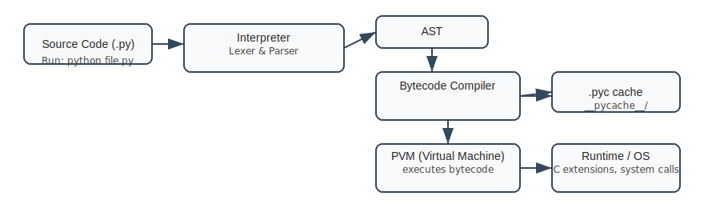
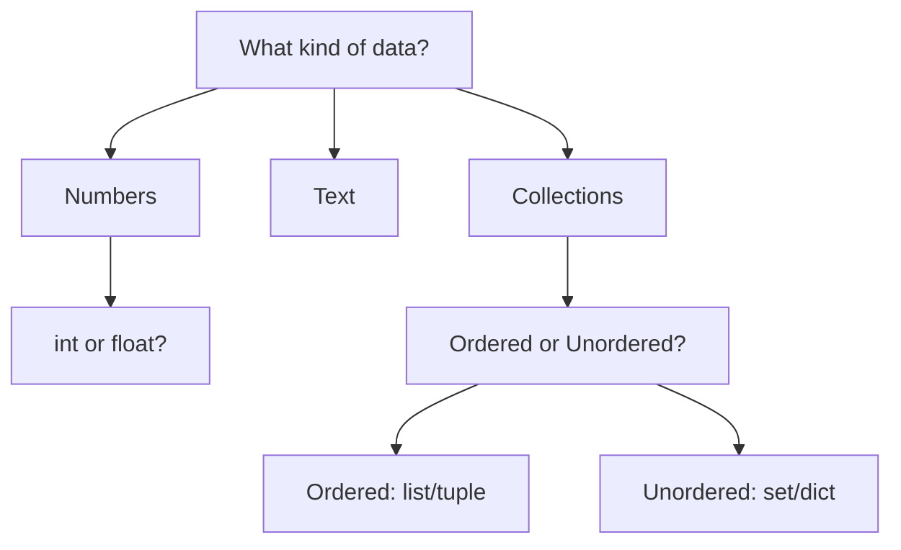
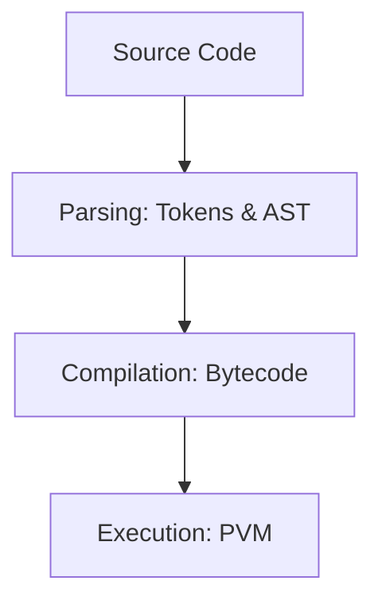
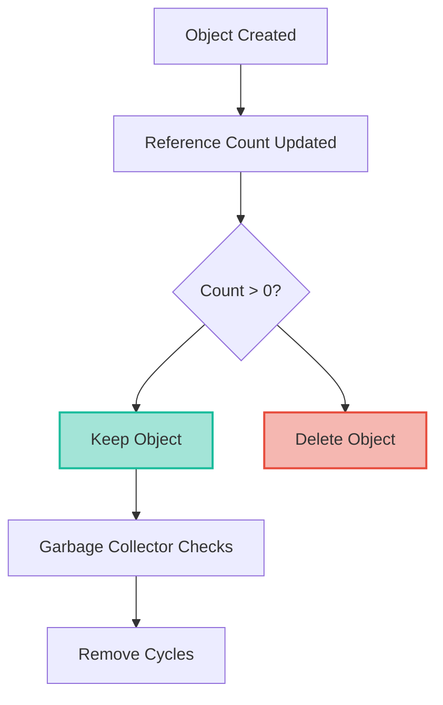
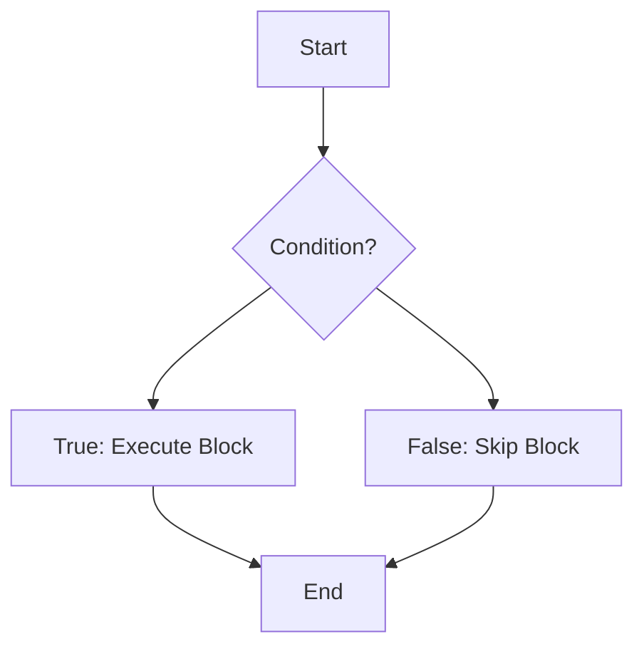
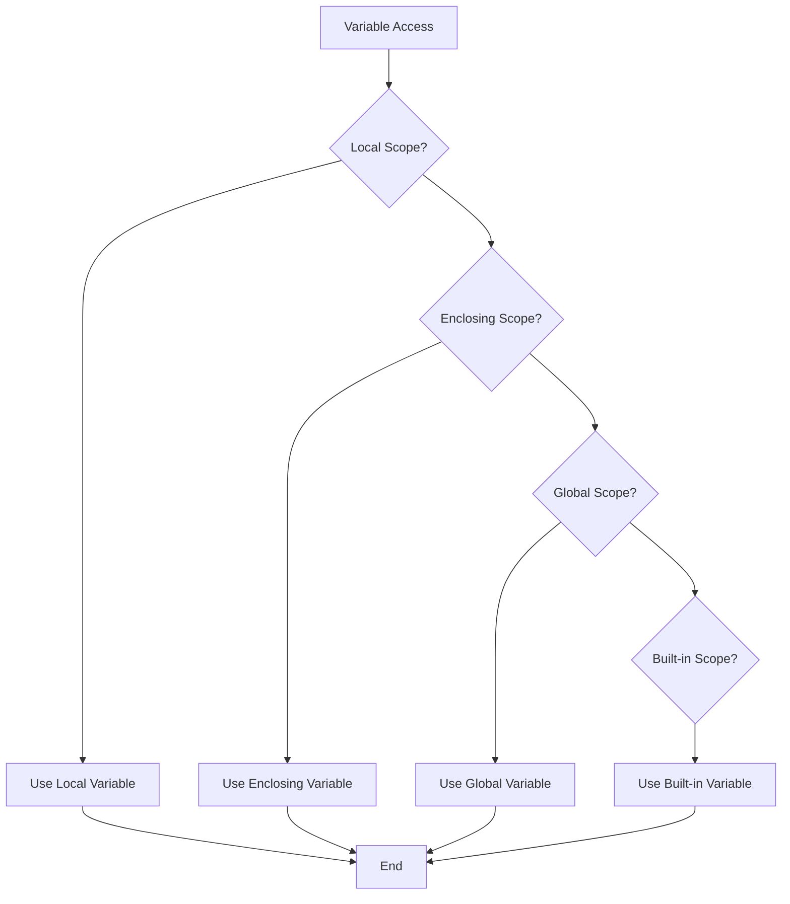
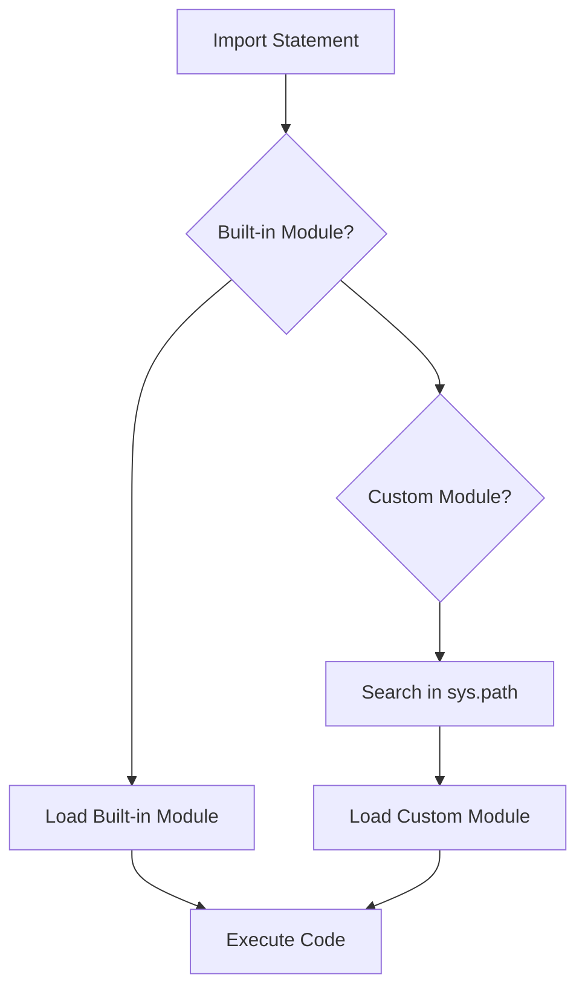

# Python Fundamentals - Quick Links

**[How Python Works](#how-python-works)**  
Interpreter, bytecode, PVM execution flow

**[Python Lifecycle](#python-lifecycle)**  
Code → .pyc → execution → cleanup cycle

**[Data Types](#data-types)**  
int, float, str, bool, None + collections overview

**[Execution Model](#execution-model)**  
Bytecode compilation, PVM, dis module

**[Memory Management](#memory-management)**  
Reference counting + garbage collection

**[Control Flow](#control-flow)**  
if/elif/else, for/while...else, match statement

**[Variable Scoping](#variable-scoping)**  
LEGB rule (Local→Enclosing→Global→Builtins)

**[Modules Basics](#modules-basics)**  
__name__ == "__main__", import system, sys.path

---

## How Python Works

Python is an **interpreted**, **high-level**, **dynamically typed** language that executes code through a multi-step process. This section explains the execution flow and lifecycle of Python programs in detail.

### Execution Flow Diagram



```mermaid
flowchart LR
   A[Source Code (.py)] --> B[Interpreter
   (Lexer & Parser)]
   B --> C[AST]
   C --> D[Bytecode Compiler]
   D --> F[PVM (Python Virtual Machine)]
   D --> E[.pyc cache
   (__pycache__/)]
   F --> G[Runtime: C extensions / OS]
```

**Legend / Tips**
- **Source Code (.py)**: This is your Python script file, written in plain text. It contains the instructions you want Python to execute.
- **Interpreter (Lexer & Parser)**: The interpreter reads your code, tokenizes it (Lexer), and builds a structured representation called the Abstract Syntax Tree (AST).
- **AST → Bytecode**: The AST is compiled into bytecode, which is a lower-level, platform-independent representation of your code.
- **.pyc cache**: Bytecode is cached in the `__pycache__/` directory to speed up subsequent runs.
- **PVM**: The Python Virtual Machine executes the bytecode, handling operations like function calls and arithmetic.
- **Runtime**: The PVM interacts with the operating system and calls C extensions (e.g., NumPy) for optimized performance.

You can preview the SVG in VS Code directly or view the Mermaid block if your Markdown renderer supports it.

### Step-by-Step Breakdown

#### 1. Source Code (.py)
Your Python script is written in plain text and saved with a `.py` extension. For example:

```python
# hello.py
print("Hello, World!")
```

#### 2. Python Interpreter
The interpreter processes your code in two main steps:
- **Lexer**: Breaks the code into tokens. For example, the line `print("Hello, World!")` is tokenized into `print`, `(`, `"Hello, World!"`, and `)`.
- **Parser**: Converts tokens into an Abstract Syntax Tree (AST), which represents the structure of your code.

Run the interpreter with:
```bash
python hello.py
```

#### 3. Bytecode Compiler
The AST is compiled into bytecode, a platform-independent representation of your code. Bytecode is saved as `.pyc` files in the `__pycache__/` directory for faster execution in subsequent runs.

To manually compile a file:
```bash
python -m py_compile hello.py
```

#### 4. Python Virtual Machine (PVM)
The PVM executes the bytecode instructions. It uses a stack-based architecture to perform operations like loading constants, adding values, and calling functions. You can inspect the bytecode with the `dis` module:

```python
import dis

def greet():
    print("Hello, World!")

dis.dis(greet)
```

#### 5. Machine Code and Runtime
The PVM interacts with the operating system and calls optimized C extensions for performance-critical tasks. For example, libraries like NumPy use C code under the hood to achieve high performance.

### Key Characteristics

| Trait         | Python                  | vs Compiled (C++)       |
|---------------|-------------------------|-------------------------|
| **Typing**    | Dynamic (`x=5; x="hi"`) | Static                  |
| **Execution** | Interpreted (line-by-line) | Compiled ahead          |
| **Memory**    | Automatic GC            | Manual (malloc/free)    |
| **Speed**     | Slower startup, JIT possible (PyPy) | Faster native |
| **Debug**     | Runtime errors          | Compile-time errors     |

---

## Python Lifecycle

The Python lifecycle describes the journey of your code from writing to execution and cleanup. Understanding this lifecycle helps you optimize performance and debug issues effectively.

### Step-by-Step Lifecycle

#### 1. Writing the Code
You write Python code in a `.py` file using any text editor or IDE. For example:

```python
# example.py
name = input("What is your name? ")
print(f"Hello, {name}!")
```

#### 2. Compilation to Bytecode
When you run the script, Python compiles it into bytecode. This step is automatic and happens behind the scenes. Bytecode is a low-level, platform-independent representation of your code.

- **Why Bytecode?** It speeds up execution by skipping the parsing and compilation steps during subsequent runs.
- **Where is Bytecode Stored?** In the `__pycache__` directory as `.pyc` files.

Example:
```bash
python example.py
```
This creates a `__pycache__/example.cpython-310.pyc` file (for Python 3.10).

#### 3. Execution by the Python Virtual Machine (PVM)
The PVM reads the bytecode and executes it line by line. It handles operations like:
- Arithmetic calculations
- Function calls
- Memory management

#### 4. Cleanup
After execution, Python cleans up resources like memory and file handles. This is managed by the garbage collector.

### Real-World Analogy
Think of Python's lifecycle as preparing and delivering a meal:
1. **Writing the Code**: Writing a recipe.
2. **Compilation**: Prepping ingredients (chopping, measuring).
3. **Execution**: Cooking the meal.
4. **Cleanup**: Washing dishes and cleaning the kitchen.

### Flowchart

```mermaid
flowchart TD
    A[Write Code (.py)] --> B[Compile to Bytecode (.pyc)]
    B --> C[Execute with PVM]
    C --> D[Cleanup Resources]
```

This lifecycle ensures that Python programs are easy to write, execute, and maintain.

---

## Data Types

Data types define the kind of values a variable can hold. Python provides several built-in data types to handle different kinds of data. Here’s an overview with examples:

### 1. Numeric Types
- **int**: Represents integers (whole numbers).
  ```python
  age = 25
  print(type(age))  # Output: <class 'int'>
  ```
- **float**: Represents decimal numbers.
  ```python
  price = 19.99
  print(type(price))  # Output: <class 'float'>
  ```
- **complex**: Represents complex numbers.
  ```python
  z = 3 + 4j
  print(type(z))  # Output: <class 'complex'>
  ```

### 2. Text Type
- **str**: Represents strings (text).
  ```python
  name = "Alice"
  print(type(name))  # Output: <class 'str'>
  ```

### 3. Boolean Type
- **bool**: Represents `True` or `False` values.
  ```python
  is_student = True
  print(type(is_student))  # Output: <class 'bool'>
  ```

### 4. None Type
- **NoneType**: Represents the absence of a value.
  ```python
  result = None
  print(type(result))  # Output: <class 'NoneType'>
  ```

### 5. Collection Types
- **list**: Ordered, mutable collection.
  ```python
  fruits = ["apple", "banana", "cherry"]
  print(type(fruits))  # Output: <class 'list'>
  ```
- **tuple**: Ordered, immutable collection.
  ```python
  coordinates = (10, 20)
  print(type(coordinates))  # Output: <class 'tuple'>
  ```
- **set**: Unordered, unique collection.
  ```python
  unique_numbers = {1, 2, 3}
  print(type(unique_numbers))  # Output: <class 'set'>
  ```
- **dict**: Key-value pairs.
  ```python
  student = {"name": "Alice", "age": 25}
  print(type(student))  # Output: <class 'dict'>
  ```

### Real-World Analogy
Think of data types as containers:
- **int**: A jar for whole candies.
- **float**: A measuring cup for liquids.
- **str**: A box for letters.
- **list**: A basket for groceries (you can add/remove items).
- **tuple**: A sealed box (contents cannot change).
- **set**: A bag of unique marbles.
- **dict**: A labeled drawer (key = label, value = content).

### Flowchart: Choosing the Right Data Type



Understanding data types is crucial for writing efficient and bug-free Python programs.

---

## Execution Model

The Python execution model describes how Python code is processed and executed. It involves several steps, from parsing to execution, and understanding this model helps in debugging and optimizing code.

### Step-by-Step Execution

#### 1. Parsing
The Python interpreter reads the source code and converts it into tokens. These tokens are then used to build an Abstract Syntax Tree (AST), which represents the structure of the code.

Example:
```python
x = 5 + 3
```
- Tokens: `x`, `=`, `5`, `+`, `3`
- AST: Represents the assignment operation and addition.

#### 2. Compilation
The AST is compiled into bytecode, which is a low-level, platform-independent representation of the code. Bytecode is stored in `.pyc` files for faster execution in subsequent runs.

#### 3. Execution
The Python Virtual Machine (PVM) executes the bytecode. It uses a stack-based architecture to perform operations like:
- Loading constants
- Performing arithmetic
- Calling functions

Example:
```python
import dis

def add_numbers(a, b):
    return a + b

dis.dis(add_numbers)
```
Output:
```
  2           0 LOAD_FAST                0 (a)
              2 LOAD_FAST                1 (b)
              4 BINARY_ADD
              6 RETURN_VALUE
```

### Real-World Analogy
Think of the execution model as preparing a dish:
1. **Parsing**: Reading the recipe and understanding the steps.
2. **Compilation**: Preparing the ingredients and tools.
3. **Execution**: Cooking the dish step by step.

### Flowchart



Understanding the execution model helps in writing efficient and optimized Python programs.

---

## Memory Management

Memory management in Python is automatic and involves techniques like reference counting and garbage collection. This ensures efficient use of memory and prevents memory leaks.

### Key Concepts

#### 1. Reference Counting
Every object in Python has a reference count, which tracks how many variables or objects refer to it. When the reference count drops to zero, the object is deleted.

Example:
```python
x = [1, 2, 3]  # Reference count = 1
y = x          # Reference count = 2
z = x          # Reference count = 3

del x          # Reference count = 2
```

#### 2. Garbage Collection
Python uses a garbage collector to clean up objects that are no longer in use, especially those involved in circular references.

Example:
```python
import gc

def create_cycle():
    a = {}
    b = {"ref": a}
    a["ref"] = b

create_cycle()
print(gc.collect())  # Force garbage collection
```

#### 3. Memory Allocation
Python uses private heaps to store objects and data structures. The memory manager handles allocation and deallocation.

### Real-World Analogy
Think of memory management as managing a library:
- **Reference Counting**: Keeping track of how many people are reading a book.
- **Garbage Collection**: Removing books that are no longer being read.
- **Memory Allocation**: Organizing books on shelves for easy access.

### Flowchart



### Tips for Efficient Memory Usage
- Use `del` to delete variables no longer needed.
- Avoid circular references.
- Use memory profiling tools like `tracemalloc` to debug memory issues.

Understanding memory management helps in writing efficient and robust Python programs.

---

## Control Flow

Control flow determines the order in which statements are executed in a Python program. Python provides several constructs to control the flow of execution.

### 1. Conditional Statements
Conditional statements allow you to execute code based on certain conditions.

Example:
```python
age = 18
if age >= 18:
    print("You are an adult.")
elif age > 12:
    print("You are a teenager.")
else:
    print("You are a child.")
```

### 2. Loops
Loops allow you to repeat a block of code multiple times.

#### For Loop
Used to iterate over a sequence (e.g., list, tuple, string).
```python
fruits = ["apple", "banana", "cherry"]
for fruit in fruits:
    print(fruit)
```

#### While Loop
Used to execute a block of code as long as a condition is true.
```python
count = 0
while count < 5:
    print(count)
    count += 1
```

### 3. Match Statement (Python 3.10+)
The `match` statement is similar to a `switch` statement in other languages. It allows you to match patterns.

Example:
```python
def http_status(code):
    match code:
        case 200:
            return "OK"
        case 404:
            return "Not Found"
        case _:
            return "Unknown"

print(http_status(200))  # Output: OK
```

### Real-World Analogy
Think of control flow as traffic signals:
- **if/elif/else**: Deciding which route to take based on the signal.
- **for/while loops**: Repeatedly driving around a roundabout until you find the right exit.
- **match**: Choosing the correct lane based on your destination.

### Flowchart: Conditional Statements



### Tips for Writing Control Flow
- Use descriptive variable names to make conditions clear.
- Avoid infinite loops unless necessary.
- Use `break` and `continue` to control loop execution.

Mastering control flow is essential for writing logical and efficient Python programs.

---

## Variable Scoping

Variable scoping determines where a variable can be accessed in your code. Python follows the LEGB rule to resolve variable names.

### LEGB Rule
The LEGB rule stands for:
1. **Local**: Variables defined inside a function.
2. **Enclosing**: Variables in the enclosing function (for nested functions).
3. **Global**: Variables defined at the top level of a script or module.
4. **Built-in**: Variables pre-defined by Python (e.g., `len`, `print`).

### Examples

#### Local Scope
Variables defined inside a function are local to that function.
```python
def greet():
    name = "Alice"  # Local variable
    print(f"Hello, {name}!")

greet()
# print(name)  # Error: name is not defined
```

#### Enclosing Scope
Variables in the enclosing function are accessible to nested functions.
```python
def outer():
    message = "Hi"

    def inner():
        print(message)  # Accessing enclosing variable

    inner()

outer()
```

#### Global Scope
Variables defined outside any function are global.
```python
x = 10  # Global variable

def show():
    print(x)  # Accessing global variable

show()
```

#### Built-in Scope
Python provides built-in functions and constants.
```python
print(len([1, 2, 3]))  # Built-in function
```

### Real-World Analogy
Think of variable scoping as searching for a book:
- **Local**: Check your desk.
- **Enclosing**: Check your room.
- **Global**: Check your house.
- **Built-in**: Check the library.

### Flowchart: Variable Resolution



### Tips for Managing Scope
- Avoid using global variables unless necessary.
- Use descriptive variable names to avoid conflicts.
- Use the `global` keyword to modify global variables inside a function.

Understanding variable scoping helps in writing clean and bug-free Python code.

---

## Modules Basics

Modules in Python are files containing Python code (functions, classes, variables) that can be reused in other programs. They help in organizing code and promoting reusability.

### Importing Modules
You can import a module using the `import` statement.

Example:
```python
import math

print(math.sqrt(16))  # Output: 4.0
```

### Importing Specific Functions or Variables
You can import specific items from a module using the `from ... import ...` syntax.

Example:
```python
from math import pi, sin

print(pi)  # Output: 3.141592653589793
print(sin(0))  # Output: 0.0
```

### Aliasing Modules
You can give a module an alias using the `as` keyword.

Example:
```python
import numpy as np

array = np.array([1, 2, 3])
print(array)
```

### Writing Your Own Module
A module is simply a Python file. For example, create a file `greetings.py`:
```python
def say_hello(name):
    return f"Hello, {name}!"
```

You can import and use it in another script:
```python
from greetings import say_hello

print(say_hello("Alice"))
```

### Special Variable: `__name__`
The `__name__` variable determines if a module is being run directly or imported.

Example:
```python
# mymodule.py
if __name__ == "__main__":
    print("This module is run directly.")
else:
    print("This module is imported.")
```

### Real-World Analogy
Think of modules as toolkits:
- **Importing a module**: Borrowing a toolkit.
- **Using specific functions**: Picking specific tools from the kit.
- **Writing your own module**: Creating a custom toolkit for your needs.

### Flowchart: Module Import Process



### Tips for Using Modules
- Use built-in modules whenever possible to avoid reinventing the wheel.
- Organize your code into modules for better readability and reusability.
- Use virtual environments to manage dependencies.

Understanding modules is essential for writing modular and maintainable Python programs.


