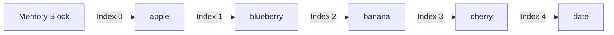
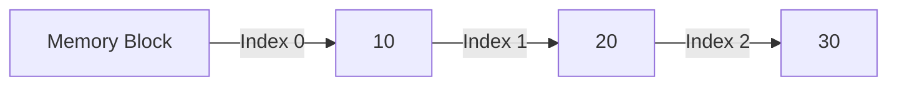
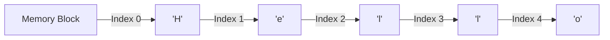

# Python Data Structures - Quick Links

**[Lists](#lists)**  
Dynamic arrays, slicing, methods, comprehensions

**[Tuples](#tuples)**  
Immutable sequences, unpacking, namedtuples

**[Dictionaries](#dictionaries)**  
Hash tables, dict comprehensions, defaultdict

**[Sets](#sets)**  
Unordered unique elements, set operations

**[Collections Module](#collections-module)**  
deque, Counter, OrderedDict, namedtuple

**[Strings](#strings)**  
Immutable sequences, formatting, methods

## Lists

Lists are dynamic arrays in Python that can hold elements of different data types. They are mutable, meaning you can modify their contents after creation.

### Properties of Lists
- **Ordered**: Elements maintain their insertion order.
- **Mutable**: You can add, remove, or change elements.
- **Dynamic**: Lists can grow or shrink in size.
- **Indexed**: Elements can be accessed using their index.

### Sample Code

#### Creating and Inserting Elements
```python
# Creating a list
fruits = ["apple", "banana", "cherry"]

# Adding elements
fruits.append("date")  # Adds 'date' to the end
fruits.insert(1, "blueberry")  # Inserts 'blueberry' at index 1

print(fruits)  # Output: ['apple', 'blueberry', 'banana', 'cherry', 'date']
```

#### Fetching Elements
```python
# Accessing elements by index
print(fruits[0])  # Output: 'apple'

# Slicing
print(fruits[1:3])  # Output: ['blueberry', 'banana']
```

#### Removing Elements
```python
# Removing by value
fruits.remove("banana")

# Removing by index
removed_item = fruits.pop(2)
print(removed_item)  # Output: 'cherry'

# Clearing the list
fruits.clear()
print(fruits)  # Output: []
```

### Backend Implementation
Lists in Python are implemented as **dynamic arrays**. Internally, they use a contiguous block of memory, which allows for fast random access (O(1) for indexing). When the list grows beyond its current capacity, Python allocates a larger block of memory and copies the elements to the new block.

- **Amortized Time Complexity**:
  - Append: O(1)
  - Insert: O(n)
  - Remove: O(n)
  - Access: O(1)

### Real-World Analogy
Think of a list as a train:
- Each car (element) is connected in a specific order.
- You can add or remove cars, but it may require shifting other cars (elements).

### Visual Representation



Lists are one of the most versatile and commonly used data structures in Python.

## Tuples

Tuples are immutable sequences in Python, meaning their contents cannot be changed after creation. They are often used to group related data.

### Properties of Tuples
- **Ordered**: Elements maintain their insertion order.
- **Immutable**: Once created, elements cannot be added, removed, or changed.
- **Indexed**: Elements can be accessed using their index.
- **Hashable**: Tuples can be used as keys in dictionaries if they contain only hashable elements.

### Sample Code

#### Creating and Accessing Elements
```python
# Creating a tuple
coordinates = (10, 20, 30)

# Accessing elements by index
print(coordinates[0])  # Output: 10

# Slicing
print(coordinates[1:])  # Output: (20, 30)
```

#### Unpacking Tuples
```python
# Unpacking elements
x, y, z = coordinates
print(x, y, z)  # Output: 10 20 30
```

#### Nested Tuples
```python
# Creating a nested tuple
nested = ((1, 2), (3, 4))
print(nested[0][1])  # Output: 2
```

### Backend Implementation
Tuples in Python are implemented as **immutable arrays**. They are stored in a contiguous block of memory, similar to lists, but their immutability allows Python to optimize their storage and performance.

- **Time Complexity**:
  - Access: O(1)
  - Iteration: O(n)

### Real-World Analogy
Think of a tuple as a sealed envelope:
- Once sealed, you cannot add or remove items.
- You can read the contents, but you cannot modify them.

### Visual Representation



Tuples are ideal for representing fixed collections of items, such as coordinates or database records.

## Dictionaries

Dictionaries are key-value pairs in Python, where each key is unique, and values can be of any data type. They are mutable and unordered (in versions < 3.7).

### Properties of Dictionaries
- **Key-Value Pairs**: Each key maps to a value.
- **Mutable**: You can add, remove, or modify key-value pairs.
- **Keys are Unique**: Duplicate keys are not allowed.
- **Hashable Keys**: Keys must be immutable (e.g., strings, numbers, tuples).

### Sample Code

#### Creating and Accessing Elements
```python
# Creating a dictionary
student = {"name": "Alice", "age": 25, "grade": "A"}

# Accessing values by key
print(student["name"])  # Output: Alice

# Using get() to avoid KeyError
print(student.get("age", "Not Found"))  # Output: 25
```

#### Adding and Modifying Elements
```python
# Adding a new key-value pair
student["major"] = "Computer Science"

# Modifying an existing value
student["grade"] = "A+"

print(student)
```

#### Removing Elements
```python
# Removing a key-value pair
student.pop("age")

# Clearing the dictionary
student.clear()
print(student)  # Output: {}
```

### Backend Implementation
Dictionaries in Python are implemented as **hash tables**. Each key is hashed to determine its index in the underlying array. This allows for average-case O(1) time complexity for lookups, insertions, and deletions.

- **Time Complexity**:
  - Lookup: O(1)
  - Insert: O(1)
  - Delete: O(1)

- **Collisions**: Handled using open addressing or chaining.

### Real-World Analogy
Think of a dictionary as a phone book:
- **Keys**: Names of people.
- **Values**: Their phone numbers.
- You can quickly look up a phone number using a name.

### Visual Representation

```mermaid
flowchart LR
    A[Hash Table] -->|Hash(Key: "name")| B["Alice"]
    A -->|Hash(Key: "age")| C[25]
    A -->|Hash(Key: "grade")| D["A"]
```

Dictionaries are one of the most powerful and commonly used data structures in Python.

## Sets

Sets are unordered collections of unique elements in Python. They are useful for operations like union, intersection, and difference.

### Properties of Sets
- **Unordered**: Elements do not maintain any specific order.
- **Unique Elements**: Duplicate elements are not allowed.
- **Mutable**: You can add or remove elements.
- **Set Operations**: Supports mathematical operations like union, intersection, and difference.

### Sample Code

#### Creating and Adding Elements
```python
# Creating a set
numbers = {1, 2, 3}

# Adding elements
numbers.add(4)
print(numbers)  # Output: {1, 2, 3, 4}
```

#### Removing Elements
```python
# Removing an element
numbers.remove(2)
print(numbers)  # Output: {1, 3, 4}

# Using discard (no error if element not found)
numbers.discard(5)
```

#### Set Operations
```python
# Union
set1 = {1, 2, 3}
set2 = {3, 4, 5}
print(set1 | set2)  # Output: {1, 2, 3, 4, 5}

# Intersection
print(set1 & set2)  # Output: {3}

# Difference
print(set1 - set2)  # Output: {1, 2}
```

### Backend Implementation
Sets in Python are implemented as **hash tables**. Each element is hashed to determine its position in the underlying data structure. This ensures average-case O(1) time complexity for operations like adding, removing, and checking membership.

- **Time Complexity**:
  - Add: O(1)
  - Remove: O(1)
  - Membership Test: O(1)

### Real-World Analogy
Think of a set as a bag of unique marbles:
- You can add marbles, but duplicates are not allowed.
- The order of marbles in the bag does not matter.

### Visual Representation

```mermaid
flowchart LR
    A[Hash Table] -->|Hash(1)| B[1]
    A -->|Hash(2)| C[2]
    A -->|Hash(3)| D[3]
    A -->|Hash(4)| E[4]
```

Sets are ideal for scenarios where you need to ensure uniqueness or perform mathematical set operations.

## Collections Module

The `collections` module in Python provides specialized data structures that extend the functionality of built-in types. These include `deque`, `Counter`, `OrderedDict`, and `namedtuple`.

### 1. Deque (Double-Ended Queue)
A `deque` is a list optimized for fast appends and pops from both ends.

#### Properties
- **Fast Operations**: O(1) for append and pop operations.
- **Thread-Safe**: Can be used in multi-threaded environments.

#### Sample Code
```python
from collections import deque

# Creating a deque
dq = deque(["a", "b", "c"])

# Adding elements
dq.append("d")  # Add to the right
dq.appendleft("z")  # Add to the left

# Removing elements
dq.pop()  # Remove from the right
dq.popleft()  # Remove from the left

print(dq)  # Output: deque(['a', 'b', 'c'])
```

### 2. Counter
A `Counter` is a dictionary subclass for counting hashable objects.

#### Properties
- **Counts Elements**: Tracks the frequency of elements.
- **Supports Arithmetic**: Can perform addition, subtraction, etc., on counts.

#### Sample Code
```python
from collections import Counter

# Counting elements
words = ["apple", "banana", "apple", "orange", "banana", "apple"]
count = Counter(words)
print(count)  # Output: Counter({'apple': 3, 'banana': 2, 'orange': 1})

# Accessing counts
print(count["apple"])  # Output: 3
```

### 3. OrderedDict
An `OrderedDict` remembers the order in which keys were inserted (in Python 3.7+, regular dictionaries also maintain order).

#### Properties
- **Ordered Keys**: Maintains insertion order.
- **Mutable**: Supports adding, removing, and updating elements.

#### Sample Code
```python
from collections import OrderedDict

# Creating an OrderedDict
od = OrderedDict()
od["a"] = 1
od["b"] = 2
od["c"] = 3

print(od)  # Output: OrderedDict([('a', 1), ('b', 2), ('c', 3)])
```

### 4. NamedTuple
A `namedtuple` is a lightweight object type that allows you to access fields by name instead of index.

#### Properties
- **Immutable**: Fields cannot be modified after creation.
- **Readable**: Fields can be accessed by name.

#### Sample Code
```python
from collections import namedtuple

# Creating a namedtuple
Point = namedtuple("Point", ["x", "y"])
point = Point(10, 20)

print(point.x)  # Output: 10
print(point.y)  # Output: 20
```

### Backend Implementation
- **Deque**: Implemented as a doubly linked list.
- **Counter**: Subclass of `dict` with additional methods.
- **OrderedDict**: Subclass of `dict` with a doubly linked list to maintain order.
- **NamedTuple**: Implemented as a subclass of `tuple` with named fields.

### Real-World Analogy
- **Deque**: A line at a ticket counter where people can join or leave from either end.
- **Counter**: A tally counter used to count occurrences.
- **OrderedDict**: A recipe book where the order of ingredients matters.
- **NamedTuple**: A labeled box where you can access items by their labels.

The `collections` module provides powerful tools for working with data efficiently.

## Strings

Strings are immutable sequences of characters in Python. They are one of the most commonly used data types for handling text.

### Properties of Strings
- **Immutable**: Once created, strings cannot be modified.
- **Indexed**: Characters can be accessed using their index.
- **Iterable**: Strings can be iterated over character by character.
- **Support for Methods**: Strings have many built-in methods for manipulation.

### Sample Code

#### Creating and Accessing Strings
```python
# Creating a string
text = "Hello, World!"

# Accessing characters by index
print(text[0])  # Output: 'H'

# Slicing
print(text[7:12])  # Output: 'World'
```

#### String Methods
```python
# Converting to uppercase
print(text.upper())  # Output: 'HELLO, WORLD!'

# Replacing substrings
print(text.replace("World", "Python"))  # Output: 'Hello, Python!'

# Splitting and joining
words = text.split(", ")
print(words)  # Output: ['Hello', 'World!']
print("-".join(words))  # Output: 'Hello-World!'
```

#### Checking Membership
```python
# Checking if a substring exists
print("Hello" in text)  # Output: True
print("Python" in text)  # Output: False
```

### Backend Implementation
Strings in Python are implemented as **immutable arrays of Unicode characters**. Each character is stored as a code point, which allows Python to handle text in multiple languages.

- **Time Complexity**:
  - Access: O(1)
  - Concatenation: O(n) (creates a new string)
  - Slicing: O(k), where k is the length of the slice

### Real-World Analogy
Think of a string as a chain of beads:
- Each bead (character) is fixed in place.
- You can create a new chain by rearranging or adding beads, but the original chain remains unchanged.

### Visual Representation



### Tips for Working with Strings
- Use f-strings (formatted string literals) for better readability:
  ```python
  name = "Alice"
  print(f"Hello, {name}!")  # Output: 'Hello, Alice!'
  ```
- Avoid using `+` for concatenation in loops; use `join` instead for better performance.

Strings are versatile and essential for text processing in Python.


