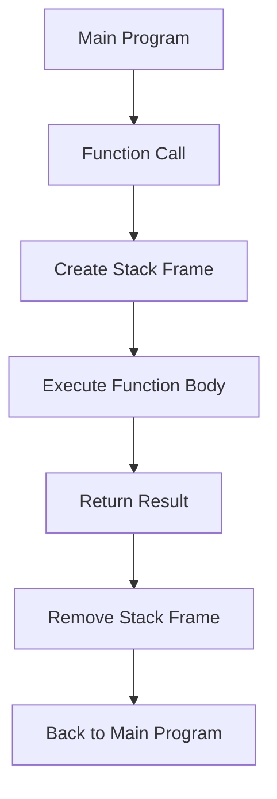
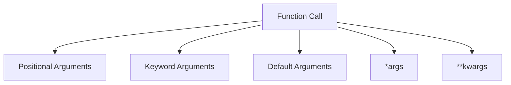
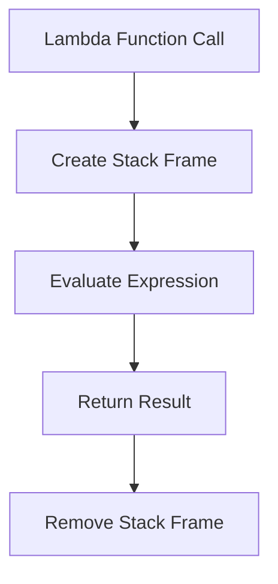
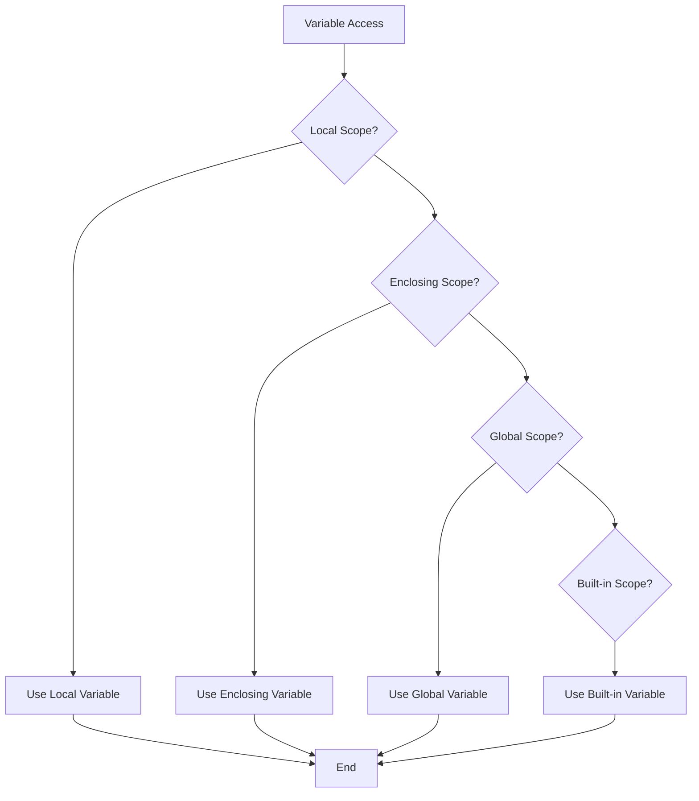

# Python Functions - Quick Links

**[Function Basics](#function-basics)**  
Definition, arguments, return, docstrings

**[Parameters Types](#parameters-types)**  
Positional, keyword, defaults, *args, **kwargs

**[Lambda Functions](#lambda-functions)**  
Anonymous functions, map/filter/reduce

**[Scope & Closures](#scope--closures)**  
LEGB revisited, nonlocal, closures preview

**[Advanced Args](#advanced-args)**  
Variable args unpacking, / and * markers (3.8+)

**[Functional Tools](#functional-tools)**  
map(), filter(), functools.reduce(), itertools

---


## Function Basics

Functions are reusable blocks of code that perform a specific task. They help in organizing code, improving readability, and avoiding repetition.

### Defining a Function
A function is defined using the `def` keyword, followed by the function name, parentheses, and a colon. The body of the function contains the code to be executed.

Example:
```python
def greet(name):
    """This function greets the user by name."""
    print(f"Hello, {name}!")

# Calling the function
greet("Alice")  # Output: Hello, Alice!
```

### Function Arguments
Functions can accept arguments (inputs) to customize their behavior.

Example:
```python
def add(a, b):
    """This function adds two numbers."""
    return a + b

result = add(5, 3)
print(result)  # Output: 8
```

### Return Statement
The `return` statement is used to send a result back to the caller.

Example:
```python
def square(x):
    return x * x

print(square(4))  # Output: 16
```

### Docstrings
Docstrings are used to document what a function does. They are written as the first statement in the function body and enclosed in triple quotes.

Example:
```python
def multiply(a, b):
    """This function multiplies two numbers."""
    return a * b

help(multiply)  # Displays the docstring
```

### Where Function Execution Occurs
When a function is called, Python creates a new **stack frame** for the function in memory. This stack frame contains:
- **Local Variables**: Variables defined inside the function.
- **Return Address**: The point in the program where execution should return after the function call.

Once the function completes execution, its stack frame is removed, and control returns to the caller.

### Real-World Analogy
Think of a function as a recipe:
- **Definition**: The recipe instructions.
- **Arguments**: The ingredients you provide.
- **Return Value**: The dish you prepare.
- **Execution**: Following the recipe step by step.

### Visual Representation



Functions are the building blocks of Python programs, enabling modular and reusable code.

---

## Parameters Types

Python functions support various types of parameters to handle different use cases. These include positional, keyword, default, and variable-length arguments.

### 1. Positional Arguments
Positional arguments are the most common type. Their values are assigned based on their position in the function call.

Example:
```python
def greet(first_name, last_name):
    print(f"Hello, {first_name} {last_name}!")

greet("Alice", "Smith")  # Output: Hello, Alice Smith!
```

### 2. Keyword Arguments
Keyword arguments are passed by explicitly specifying the parameter name. This improves readability and allows arguments to be passed in any order.

Example:
```python
def greet(first_name, last_name):
    print(f"Hello, {first_name} {last_name}!")

greet(last_name="Smith", first_name="Alice")  # Output: Hello, Alice Smith!
```

### 3. Default Arguments
Default arguments allow you to specify a default value for a parameter. If no value is provided, the default is used.

Example:
```python
def greet(name, greeting="Hello"):
    print(f"{greeting}, {name}!")

greet("Alice")  # Output: Hello, Alice!
greet("Bob", "Hi")  # Output: Hi, Bob!
```

### 4. Variable-Length Arguments
Variable-length arguments allow you to pass an arbitrary number of arguments to a function.

#### *args (Non-Keyword Arguments)
`*args` collects additional positional arguments into a tuple.
```python
def add(*numbers):
    return sum(numbers)

print(add(1, 2, 3))  # Output: 6
```

#### **kwargs (Keyword Arguments)
`**kwargs` collects additional keyword arguments into a dictionary.
```python
def print_info(**info):
    for key, value in info.items():
        print(f"{key}: {value}")

print_info(name="Alice", age=25)  # Output: name: Alice, age: 25
```

### 5. Positional-Only and Keyword-Only Arguments (Python 3.8+)
- **Positional-Only**: Use `/` to specify that arguments must be passed positionally.
- **Keyword-Only**: Use `*` to specify that arguments must be passed as keywords.

Example:
```python
def greet(name, /, greeting, *, punctuation="!"):
    print(f"{greeting}, {name}{punctuation}")

greet("Alice", "Hello", punctuation=".")  # Output: Hello, Alice.
```

### Real-World Analogy
Think of function parameters as filling out a form:
- **Positional Arguments**: Filling fields in order.
- **Keyword Arguments**: Labeling fields explicitly.
- **Default Arguments**: Pre-filled fields.
- **Variable-Length Arguments**: Adding extra fields as needed.

### Visual Representation



Understanding parameter types allows you to write flexible and reusable functions.

## Lambda Functions

Lambda functions are anonymous functions in Python, meaning they do not have a name. They are often used for short, simple operations.

### Syntax
A lambda function is defined using the `lambda` keyword, followed by parameters, a colon, and the expression to evaluate.

Example:
```python
# Lambda function to add two numbers
add = lambda x, y: x + y

print(add(3, 5))  # Output: 8
```

### Characteristics
- **Anonymous**: Lambda functions do not have a name.
- **Single Expression**: They can only contain a single expression (no statements).
- **Inline Use**: Often used where a function is required temporarily.

### Use Cases

#### 1. Using with `map()`
`map()` applies a function to each item in an iterable.
```python
numbers = [1, 2, 3, 4]
squared = map(lambda x: x ** 2, numbers)
print(list(squared))  # Output: [1, 4, 9, 16]
```

#### 2. Using with `filter()`
`filter()` selects items from an iterable based on a condition.
```python
numbers = [1, 2, 3, 4, 5]
even_numbers = filter(lambda x: x % 2 == 0, numbers)
print(list(even_numbers))  # Output: [2, 4]
```

#### 3. Using with `sorted()`
`sorted()` can use a lambda function as a key for custom sorting.
```python
students = [("Alice", 25), ("Bob", 20), ("Charlie", 23)]
sorted_students = sorted(students, key=lambda x: x[1])
print(sorted_students)  # Output: [('Bob', 20), ('Charlie', 23), ('Alice', 25)]
```

### Where Lambda Functions Execute
Lambda functions are executed in the same way as regular functions. When called, they create a new stack frame, execute the expression, and return the result.

### Real-World Analogy
Think of a lambda function as a sticky note:
- It’s quick to write.
- It’s used for a specific, short task.
- Once the task is done, you discard it.

### Visual Representation



Lambda functions are a powerful tool for writing concise and readable code, especially in functional programming contexts.

## Scope & Closures

Scope defines the region of a program where a variable is accessible. Closures are functions that capture and remember variables from their enclosing scope.

### LEGB Rule
Python resolves variable names using the LEGB rule:
1. **Local**: Variables defined inside the current function.
2. **Enclosing**: Variables in the enclosing function (for nested functions).
3. **Global**: Variables defined at the top level of the script.
4. **Built-in**: Predefined names in Python (e.g., `len`, `print`).

Example:
```python
x = "global"

def outer():
    x = "enclosing"

    def inner():
        x = "local"
        print(x)  # Output: local

    inner()
    print(x)  # Output: enclosing

outer()
print(x)  # Output: global
```

### Closures
A closure is a function that remembers variables from its enclosing scope, even if the enclosing scope is no longer active.

Example:
```python
def outer_function(msg):
    def inner_function():
        print(msg)  # Captures 'msg' from the enclosing scope
    return inner_function

closure = outer_function("Hello, World!")
closure()  # Output: Hello, World!
```

### Using `nonlocal`
The `nonlocal` keyword allows you to modify variables in the enclosing scope.

Example:
```python
def counter():
    count = 0

    def increment():
        nonlocal count
        count += 1
        return count

    return increment

counter_func = counter()
print(counter_func())  # Output: 1
print(counter_func())  # Output: 2
```

### Where Scope Resolution Occurs
When a variable is accessed, Python searches for it in the following order:
1. **Local Scope**: Inside the current function.
2. **Enclosing Scope**: In the enclosing function (if any).
3. **Global Scope**: At the top level of the script.
4. **Built-in Scope**: Among Python’s built-in names.

### Real-World Analogy
Think of scope as searching for a tool:
- **Local**: Check your desk.
- **Enclosing**: Check your room.
- **Global**: Check your house.
- **Built-in**: Check the hardware store.

### Visual Representation



Closures and scope management are essential for writing efficient and modular Python code.

---

## Advanced Args

Advanced argument handling in Python includes features like unpacking and special markers (`/` and `*`) for positional-only and keyword-only arguments.

### 1. Argument Unpacking
You can unpack arguments from a list or dictionary using `*` and `**`.

Example:
```python
def greet(first_name, last_name):
    print(f"Hello, {first_name} {last_name}!")

# Unpacking from a list
args = ["Alice", "Smith"]
greet(*args)  # Output: Hello, Alice Smith!

# Unpacking from a dictionary
kwargs = {"first_name": "Bob", "last_name": "Brown"}
greet(**kwargs)  # Output: Hello, Bob Brown!
```

### 2. Positional-Only Arguments
Use `/` to specify that arguments must be passed positionally.

Example:
```python
def add(x, y, /):
    return x + y

print(add(3, 5))  # Output: 8
# add(x=3, y=5)  # Error: Positional-only arguments
```

### 3. Keyword-Only Arguments
Use `*` to specify that arguments must be passed as keywords.

Example:
```python
def greet(*, name, greeting="Hello"):
    print(f"{greeting}, {name}!")

greet(name="Alice")  # Output: Hello, Alice!
```

### Real-World Analogy
Think of advanced argument handling as filling out a form:
- **Unpacking**: Pre-filling fields from a template.
- **Positional-Only**: Fields that must be filled in order.
- **Keyword-Only**: Fields that must be explicitly labeled.

---

## Functional Tools

Python provides several functional programming tools, such as `map()`, `filter()`, `reduce()`, and the `itertools` module.

### 1. `map()`
`map()` applies a function to each item in an iterable.

Example:
```python
numbers = [1, 2, 3, 4]
squared = map(lambda x: x ** 2, numbers)
print(list(squared))  # Output: [1, 4, 9, 16]
```

### 2. `filter()`
`filter()` selects items from an iterable based on a condition.

Example:
```python
numbers = [1, 2, 3, 4, 5]
even_numbers = filter(lambda x: x % 2 == 0, numbers)
print(list(even_numbers))  # Output: [2, 4]
```

### 3. `reduce()`
`reduce()` applies a function cumulatively to the items in an iterable, reducing it to a single value. It is available in the `functools` module.

Example:
```python
from functools import reduce

numbers = [1, 2, 3, 4]
product = reduce(lambda x, y: x * y, numbers)
print(product)  # Output: 24
```

### 4. `itertools`
The `itertools` module provides tools for creating iterators for efficient looping.

Example:
```python
from itertools import permutations

items = ["a", "b", "c"]
perms = permutations(items, 2)
print(list(perms))  # Output: [('a', 'b'), ('a', 'c'), ('b', 'a'), ...]
```

### Real-World Analogy
Think of functional tools as kitchen gadgets:
- **`map()`**: A food processor that applies the same operation to each ingredient.
- **`filter()`**: A sieve that selects only certain ingredients.
- **`reduce()`**: A blender that combines all ingredients into one.
- **`itertools`**: Specialized tools for advanced recipes.

---

